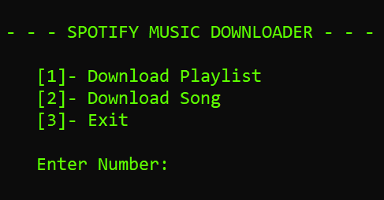

# Download spotify playlist/albums or just a spesific tracks as a mp3 file without API key requirements

## Preview


## Requirements

## 1. Python Dependencies

```bash
pip install selenium colored pytube youtube_dl
```

or run the `dep-installer.py` file.

## 2. Chrome Driver

Current ChromeDriver version is 119. Please check [here](https://googlechromelabs.github.io/chrome-for-testing/) for the latest version.

ChromeDriver version must be the same chrome version installed on your system. You can check your installed chrome version via Settings > About Chrome.

## 3. Choose A Download Option

There are 2 download options for downloading playlist. If you like to use "youtube_dl" you need to follow the additional installation steps.

### 1. pytube

if you choose to use pytube, there is no additional installation steps for it, so you can skip this step. It will be installed automatically with the other python dependencies.

### 2. youtube_dl

To order to use "youtube_dl" you need to install FFmpeg.

#### Installing FFmpeg

Download Link: <https://www.ffmpeg.org/download.html>

#### Installation for Windows

If you have chocolatey installed, you can simply install ffmpeg by running the following command:

    choco install ffmpeg

## Usage

Run the "downloader.py", choose prefered download option and paste your spotify playlist/song link. Yeah, that's all.

## Additional Notes

- The names of the tracks and youtube links are will be collected in a text file.
- Downloaded tracks will be appear in downloads folder.
- If you want to change the folder paths, you have to define your own paths in \_paths file:

```py
savePath = 'Downloads'
textPath = 'Texts/downloaded-links.txt'
nTextPath = 'Texts/skipped-links.txt'
driverPath = 'driver/chromedriver.exe'
```
## Console Look



## Links to the repositories of the libraries used in this tool

- [Selenium](
    https://github.com/SeleniumHQ/Selenium) 
- [Colored](
    https://gitlab.com/dslackw/colored)
- [Pytube](
    https://github.com/pytube/pytube)
- [yt-dlp](
    https://github.com/yt-dlp/yt-dlp)